```{r setup, include=FALSE}
knitr::opts_chunk$set(echo = TRUE)
```

&nbsp;  

Photo-identification (photo-ID) databases can comprise versatile troves of information for well-studied animal populations and, when organized well and curated carefully, can be readily applied to a wide range of research questions, such as population abundance estimates, meta-population connectivity and social network structure. To bring the potential impact of photo-ID data within reach of a greater number of research groups, we introduce an R-based photo-ID project management system, named **`catRlog`**.  


**`catRlog`** serves as a workflow organizer that simplifies, streamlines, and improves the quality of photo-ID data processing. The system can be utilized by research teams in a number of ways, ranging from automated formatting and printing of a photo-ID catalog, to photo-ID matching, thereby creating and expanding a reference (historical) catalog, to processing of identification data to generate datasets necessary for site fidelity, mark–recapture, and social association analyses. As an `R`-based tool, the apps are open-source, cross-platform, readily customizable, and easily updated.  


**`catRlog`** has been tested using photo-ID databases of humpback whales (*Megaptera novaeangliae*) and fin whales (*Balaenoptera physalus*) within a mainland fjord system of Pacific Canada, but is a generalized system useful for almost any photo-ID project of any species in any habitat. A detailed user guide and example dataset are provided through links in the [Github Repo](https://github.com/ericmkeen/catRlog).  

Note that `catRlog` was originally produced as a downloadable folder system -- essentially a simplistic version of an `R` package -- in association with [this publication](https://link.springer.com/article/10.1007%2Fs42991-021-00158-7) in a special issue in the *Journal of Mammalogy* (also viewable [here](https://rdcu.be/csdPC)). We have since converted `catRlog` to a proper R package in order to make it easier to use, maintain, and improve upon. The documentation in this vignette, and also within the help documentation for the `R` functions, provide the most up-to-date support. The `catRlog` system was developed by [Eric Keen](https://new.sewanee.edu/our-faculty-staff/eric-ezell/), [Éadin O'Mahony](https://eadinomahony.wordpress.com/), Julia Wren and [Janie Wray](https://bcwhales.org/our-team/). 


## Setting up

### Package installation 

```{r, echo=TRUE, eval=FALSE, include=TRUE, suppressWarnings=TRUE, suppressMessages=TRUE}
# Make sure you have "devtools" installed
if (!require('devtools')) install.packages('devtools')

# Install from GitHub
devtools::install_github('ericmkeen/catRlog')

# Load the libraray
library(catRlog)

# Explore help files and their examples
?catRlog
```

&nbsp;  

### Setup your project

First create a folder where you wish to keep your photo-ID project. This should be a long-term home for your catalog and all associated datasets.  

Inside that folder, create an `R` script that sets up your project director, name it something intuitive like `setup.R` and paste the following template code:  

```{r, echo=TRUE, eval=FALSE, include=TRUE, suppressWarnings=TRUE, suppressMessages=TRUE}
# catRlog photo-ID setup

# Install & library
if (!require('devtools')) install.packages('devtools')
devtools::install_github('ericmkeen/catRlog')
library(catRlog)

# Set working directory to your project folder
# (using a shortcut from the rstudioAPI package):
setwd(dirname(rstudioapi::getActiveDocumentContext()$path))

# Setup folders within your directory
setup_project()

```

&nbsp;  

#### Setup your reference catalog

Most users will be converting a pre-existing catalog to the `catRlog` system. You have at least one identified individual that serves as the start of your photo-ID program. 

In the `catRlog` system, your reference (historical) catalog has two components: a folder of ID photos and a spreadsheet key. 

&nbsp;  

##### Catalog ID photos 

Your reference catalog goes in the folder `catalog/catalog`. Each photo needs to be named in a standard way: `"<ID code><feature code>.<filename extension>"`. The feature code can be a single character only. Some examples: `"HW0452F.JPG"` (in this case, `"F"` stands for Fluke.); `"FW003L.jpg"` (in this case, the `"L"` stands for Left dorsal). This standard formatting is essential to `catRlog` functionality.

&nbsp;  

##### Spreadsheet key

Your spreadsheet key goes within the `catalog` folder (not `catalog/catalog` subfolder) and should be named simply `"catalog key.csv"`.  It must be a `".csv"`.  

Every row in in this spreadsheet is for a single individual in your catalog. 

Only one column is absolutely required: **`id`**: the ID code. It must correspond to a photo in your `catalog/catalog` folder.  You can as many other columns as you wish. If you have local nicknames for individuals, create a column named `"local`". We recommend adding columns that allow you to track demographic information (sex or known mother), as well as features that allow you to filter the catalog (e.g., injury status, dorsal fin knicks, distinctiveness scores, etc.). All columns must be single words (no spaces or special characters).  

Here is an example:  

&nbsp;  
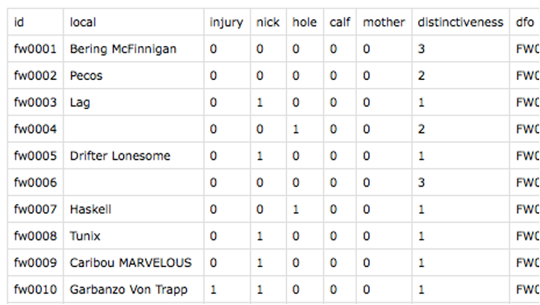{width=70%}
&nbsp;

**With these data in place, you should now be able** to open an interactive dashboard that allows you to peruse and filter your reference catalog:  

```{r, echo=TRUE, eval=FALSE, include=TRUE, suppressWarnings=TRUE, suppressMessages=TRUE}
catalog()
```


&nbsp;  
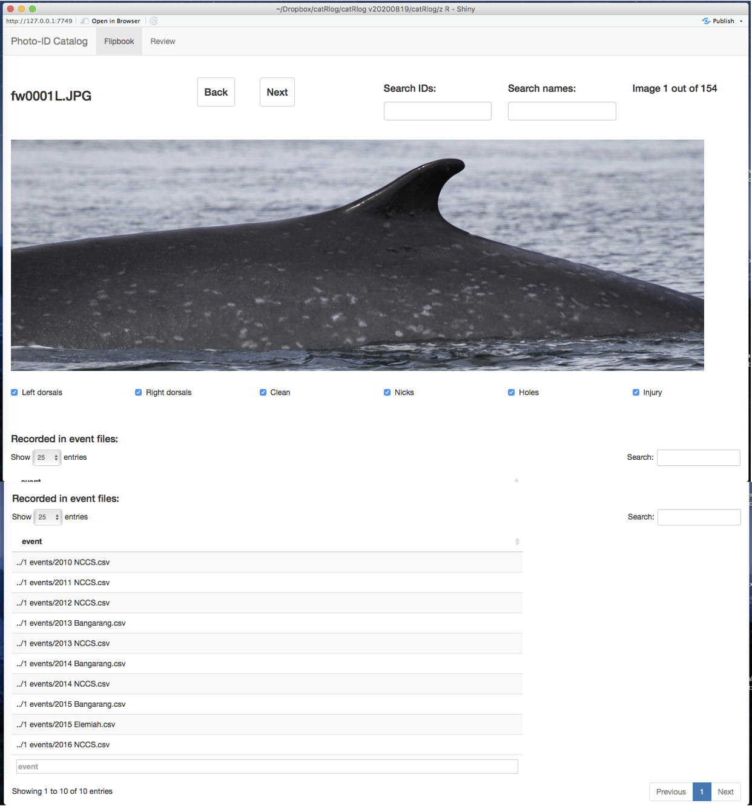{width=70%}
&nbsp;


##### Custom filtering options

*Under construction!* 

&nbsp;  

#### Bring in sightings

All records of photo-identifications should be placed as spreadsheets within the `events` folder. A convenient way to name these spreadsheets would be `"<year> <platform or photographer>.csv"`, but the spreadsheets can be named whatever you want.  

Note, however, that if there are photos associated with these events, the spreadsheet name must be exactly the same as the corresponding photo collection within the `photos` folder. For example, if I have an events spreadsheet named `"events/2016 Bangarang.csv"`, the photos associated with those events must be in a subfolder named `"photos/2016 Bangarang"`.  

In your events spreadsheet, each row represents a single identification of an individual from a single encounter. You are free to have multiple ID photos for an individual in any given encounter (e.g., a left dorsal photo and a right dorsal photo), but each photo you wish to match with must have its own row. 

The required columns are: 

- **`year`**: numeric in "YYYY" format.  

- **`month`**: numeric from 1-12.  

- **`day`**: numeric from 1-31.  

- **`group`**: a unique numeric identifier for each social group. Group identifiers only need to be unique for each day of effort.   


Semi-required columns are:  

- **`file`**: the image filename in the corresponding photos collection. Filetype extension is not required.  you need this column if you want to take advantage of matching and scoring features of the `catRlog` system, but it is not needed if you just wish to use the analytical functions in order to summarize your sighting histories. If the latter, the `id` column must be present.   

- **`id`**: the identification code for the individual. If the `file` is supplied, you can use the `catRlog` scoring and matching features to automatically fill in this `id` column. If `file` is not supplied, you will need to manually provide the `id` in order to use `catRlog`'s analytical features.  


Optional columns recognized by the `catRlog` system include...  

- **`lat`**: Latitude in decimal degrees, with southern hemisphere values negative.  

- **`lon`**: Longitude in decimal degrees, with western hemisphere values negative.  

...but you can have as many additional columns as you wish.  

Here's an example:  

&nbsp;  
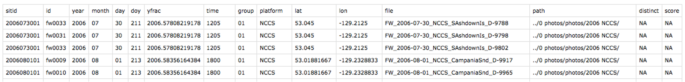{width=70%}
&nbsp;

#### Bring in photo collections 

If you want to match new photo collections to your reference catalog, add new individuals to your reference catalog, etc., you should add photo collections to your `catRlog` project. Each collection should go within its own subfolder in the `photos` folder. 

Backing up data is really important, as always. It may be best to consider this `catRlog` copy of your photos as the "working copy", with a backup saved on a separate hard drive or in the cloud. This would allow you to delete extraneous photos (e.g., scenic shots, non-ID shots, blurred shots, etc.) from the working copy within your `catRlog` folder. This saves space and reduces workloads downstream. This would also allow you to keep only the best ID photo of each feature for each individual in each encounter. This step is essential to reducing workload and avoiding confusion at the scoring and matching stages of the photo-ID project workflow. 

Once you have reduced your photo collection in these ways, this is a good time to rotate and crop ID photos so that the individual fills the frame and the aspect ratio is consistent for all photos in your system. For whales, for example, we use a 3:1 ratio. 

Remember: as noted above, your photo collections must be named the exact same as the corresponding events spreadsheet. Every photo collection needs an events spreadsheet. 

If you do not yet have a spreadsheet created, you can use the `catRlog` function `stage_events()` to jumpstart the creation of an events spreadsheet based on the files in a photo collection. See that function's documentation for details.  

&nbsp;  

With these events and photo collections in place, you are now ready to use the `catRlog` system to manage your photo-ID project. 

&nbsp;  

## Workflow

Managing a photo-ID project involves these basic steps:

- **Score photos** for distinctiveness and quality.  

- **Match photos to your reference catalog.** This is usually done by multiple analysts for redundancy and quality control. You must then reconcile match sessions across analysts and handle any discrepancies.  

- **Update the reference catalog** with any new individuals or better pictures of pre-existing individuals.   

- **Prepare a print-ready PDF of your reference catalog**

(Repeat the above steps until you are ready to do some analyses on your long-term dataset.)

- **Compile datasets to address specific analytical questions.**

&nbsp;  

#### Scoring photos

Use catRlog's scoring app to efficiently rate each photo in a collection according to standard metrics.  

```{r, echo=TRUE, eval=FALSE, include=TRUE, suppressWarnings=TRUE, suppressMessages=TRUE}
score_photos()
```

When you open the app, the first tab to appear ...

&nbsp;  
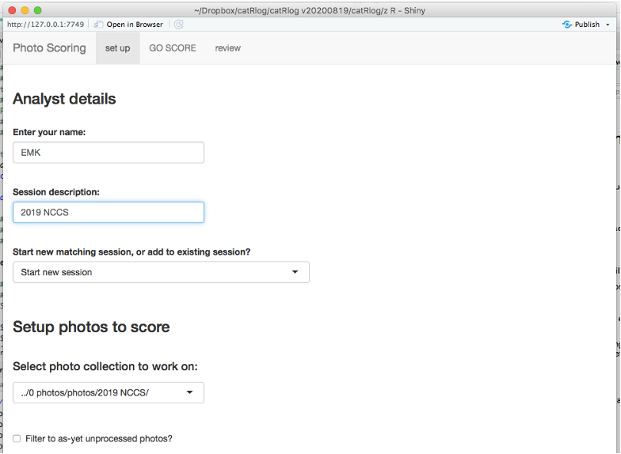{width=70%}
&nbsp;

... asks that you enter analyst initials. Doing so unlocks a botton to select a ‘scoring session’ file where your work will be saved. You can ‘Start a new session’ by providing a ‘Session Description’ (tip: I usually use the name of the photo collection).

Select the photo collection you wish to score, then go to the ‘GO SCORE’ tab, where you will scrutinize each photo in the collected one at a time. 

&nbsp;  
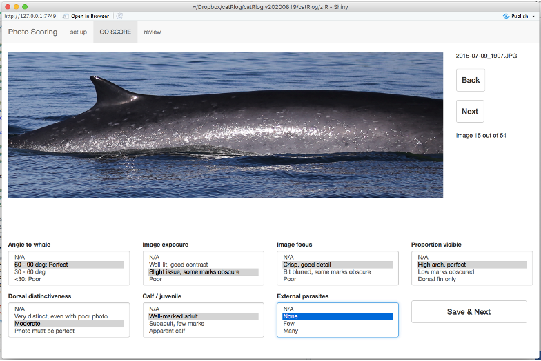{width=70%}
&nbsp;

Select quality scores for each field. Once all fields have been changed from NA, the option to click “Save & Next” will appear. This will save your scores to the scoring session's `.csv` file. Here is an example of what the scoring `.csv` output looks like: 

&nbsp;  
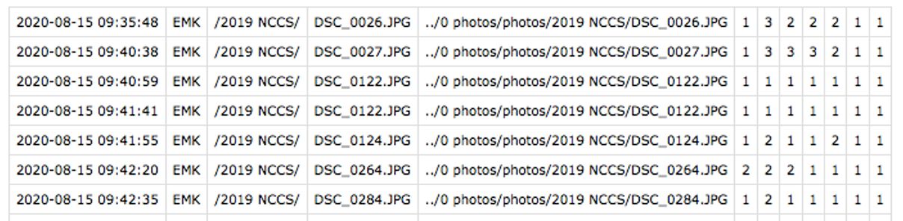{width=70%}
&nbsp;

Note that, while it is logical to score photos at this stage in the workflow, it does not technically *need* to happen until you want to compile datasets to perform analyses (the final stage), at which point you are compiling datasets based upon quality scores and distinctiveness. So it is fine to carry out matching before or during the process of scoring images. In fact, scoring can even be done in the absence of reference catalog data in the `catalog` folder. 

##### Custom scoring metrics

*Under construction!* 

&nbsp;  

#### Matching photos

When you run the `catRlog` function `match()`...  

```{r, echo=TRUE, eval=FALSE, include=TRUE, suppressWarnings=TRUE, suppressMessages=TRUE}
match()
```

a `Shiny` app will appear: 

&nbsp;  
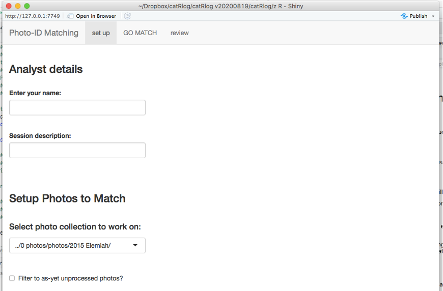{width=70%}
&nbsp;

The first tab asks that you enter analyst initials. Doing so unlocks the option to select a ‘matching session’ file where your work will be saved. You can ‘Start a new session’ by providing a ‘Session Description’ (tip: I usually just use the name of the photo collection I am working on).

Select the photo collection you wish to match, then go to the ‘GO MATCH’ tab. 

&nbsp;  
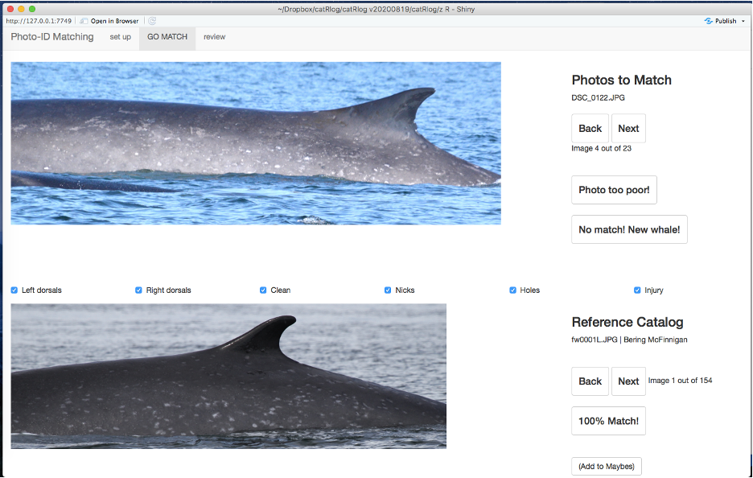{width=70%}
&nbsp;

The top image is from the photo collection. This is the photo-ID you are trying to find in the reference catalog. The bottom image is from the reference catalog. Information about this image is being pulled from `catalog/catalog key.csv`.

**Recommended workflow:**   
- For each photo to match, flip through the reference catalog to look for a match. You may filter the reference catalog according to features and marks (see the checkboxes halfway down the screen). These checkboxes correspond to columns in `catalog key.csv`.  

- If you know of an individual in the catalog that might be the match, you may search for it based on ID code and/or local name (you may need to scroll down to see this feature).  

- If the query is not easy to identify and several reference catalog IDs may qualify as a match, use the ‘Add to maybes’ button to track candidate matches. After going through the full catalog, you can then click the checkbox to ‘Filter to maybes’ (this will only appear after the button ‘Add to Maybes’ has been clicked once) and look more closely at the candidates you selected.  

- **Make a decision:** If you found a match and are 100% confident, click the **"100% Match"** button.  

- If you may have found a match but are not certain, click the **"Low-Confidence Match"** button. (*Note:* You may need to scroll down to see this option). If the photo is simply too poor to find a match with confidence, click the **"Photo too poor!"** button.  

- If the photo is of an individual that is definitely not in the reference catalog, click **"No match! New whale!"**.  

- Clicking any of these buttons will save your match decision and automatically take you to the next photo to be matched.  

- If you wish to review the match decisions you are saving, check out the ‘review’ tab.  

- Once you are done matching all the photos in this collection, simply close the app.


&nbsp;  

##### Reconciling match sessions

In most applications, multiple analysts will attempt matching a photo collection to the reference catalog. These redundant decisions must then be reconciled in order to arrive at a final decision for each photo-identification. This step will produce a single, finalized match record. Note that this step is necessary regardless of how many analysts have worked on a photo collection, even if only a single analyst was used.

Run this function ... 

```{r, echo=TRUE, eval=FALSE, include=TRUE, suppressWarnings=TRUE, suppressMessages=TRUE}
review_matches()
```

And a `Shiny` app will launch. On the Setup tab, select the match sessions that you want to reconcile. You can select several. Once you select these match sessions, the option to “Import Match Sessions” will appear. Click that button.  

After clicking, a new button will appear to "Parse matches" into sets of unanimous decisions and ‘discrepancies’ (i.e., inconsistent match decisions amongst analysts). Click it.

If there are NO discrepancies, a button will appear to ‘Consolidate & store reviewed matches’ (see screenshot to bottom-right). Click it.  

&nbsp;  
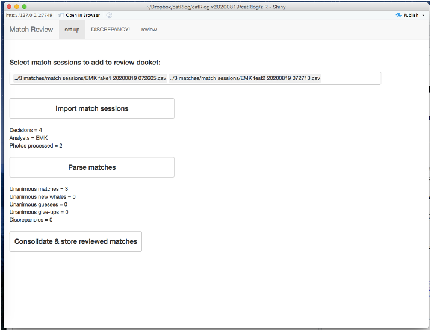{width=70%}
&nbsp;

This will produce a .csv file in catRlog/3 matches/reviewed matches with the filename “Reviewed Matches <YYYMMDD HHMMSS> .csv”. Once done, simply close the app.  

However, if there ARE discrepancies, you will be alerted as such:

&nbsp;  
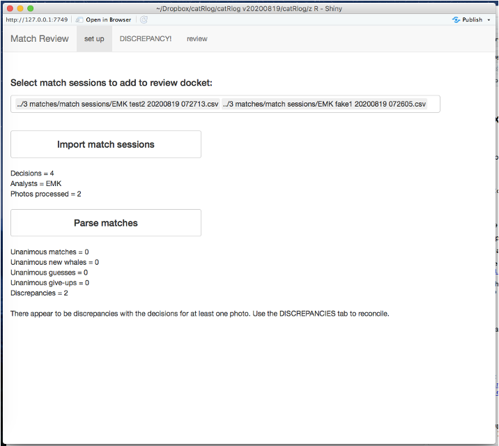{width=70%}
&nbsp;

In this case, go to the “DISCREPANCY” tab:

&nbsp;  
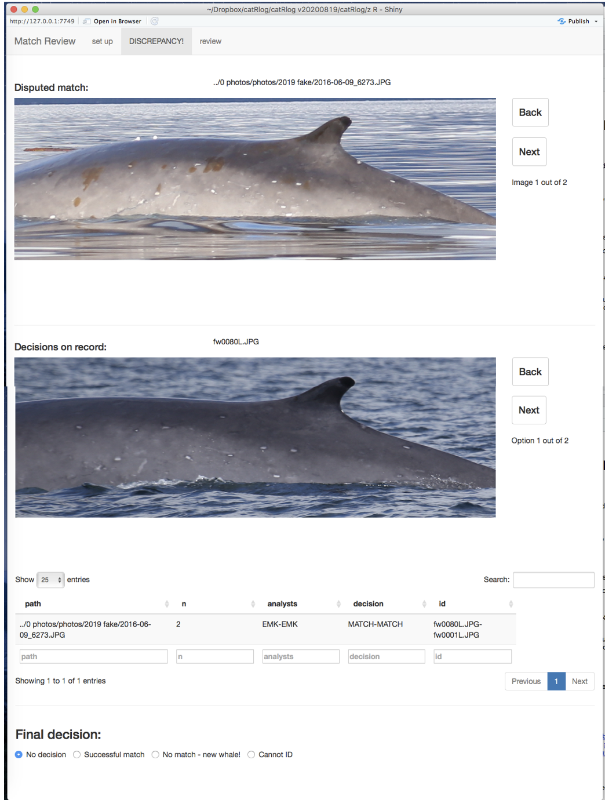{width=70%}
&nbsp;


This page is divided into four sections:  

- Top section displays the photo connected to the first disputed match.  

- Second section displays the potential matches within the reference catalog. (If the decision is that the photo is too poor to match or that this is a new individual, this space will be blank.). 

- Third section displays the match decisions in table format.  

- Bottom section is where you make your final decision about this match. If you decide that one of these matches is correct (‘Successful match’ option), you will be able to choose which reference catalog ID is the correct one.  

- Once you click an option other than “No decision”, the option will appear to ‘Save Final Decision’. 

- Do this for every discrepancy until there are no more outstanding. 

- You can then go back to the "Setup" tab and find that there is now an button option to ‘Consolidate & store reviewed matches’.

&nbsp;  

#### Update historical catalog

##### Register new IDs

Before the photos you have matched can be assigned a corresponding ID code, all of those ID codes must exist. However, the matching process is likely to uncover individuals who are not yet in the historical catalog. To register new IDs in the historical catalog, run the following:

```{r, echo=TRUE, eval=FALSE, include=TRUE, suppressWarnings=TRUE, suppressMessages=TRUE}
register_new_ids()
```

&nbsp;  
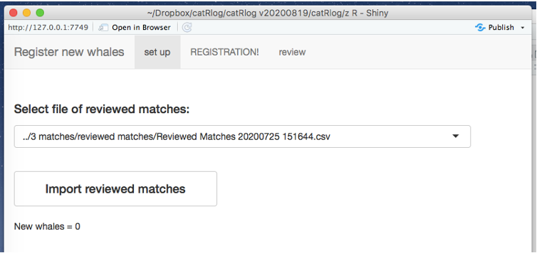{width=70%}
&nbsp;

Select the Reviewed Matches you want to look in for new individuals and click ‘Import Reviewed Matches’. If there are any new whales to register, go to the “REGISTRATION!” tab.  
&nbsp;  
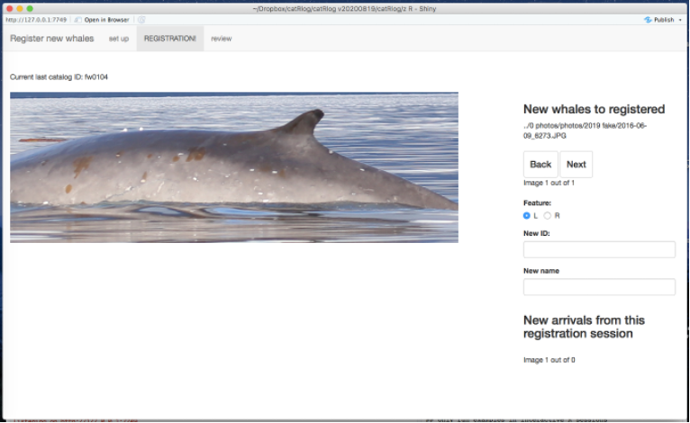{width=70%}
&nbsp;

The first new whale will be displayed. Above it is a small note indicating what the current final ID code is in your `"catalog key.csv"`.  

Select the feature displayed in this image, type in the new ID code you will assign this individual, and, if you wish, provide a local identifier / nickname in the ‘New Name’ input.  

Once you type in a new ID, the button to “Assign ID (and add to catalog, if needed).” (The parenthetical refers to the fact that you will likely have multiple photos of a single new arrival.) Click it.

When you do, this image will be copied to `catRlog/catalog` and renamed according to its new ID and the feature you selected. In addition, a new line for this new ID code will be written in `"catalog/catalog key.csv"`.  Note that, before changes are made, a backup version of the key will be save to the subfolder `catalog/old keys`.

This individual will then be added to the “New Arrivals” section at the bottom of the page. If you have subsequent images of this new whale, you will be able to use these images as a reference for typing in the correct ID code. 

Once you have registered all new whales, simply close the app.

Finally, open `"catalog key.csv"` and manually enter feature scores (0 or 1) to each category. This step is essential; the new whale will not show up in matching / digital flipbook apps until these details are added.  

&nbsp;  

##### Update IDs already in catalog

After processing a new photo collection, it is possible that you will have photos of individuals that (1) are higher quality than the ID photo in the historical catalog, (2)  contain more recent marks that are not depicted in the historical catalog, and/or (3) depict a feature that is not yet documented within the historical catalog.  

To replace photos or add photos of new features to the historical catalog, run this function: 

```{r, echo=TRUE, eval=FALSE, include=TRUE, suppressWarnings=TRUE, suppressMessages=TRUE}
update_catalog()
```

A `Shiny` app will launch:  

&nbsp;  
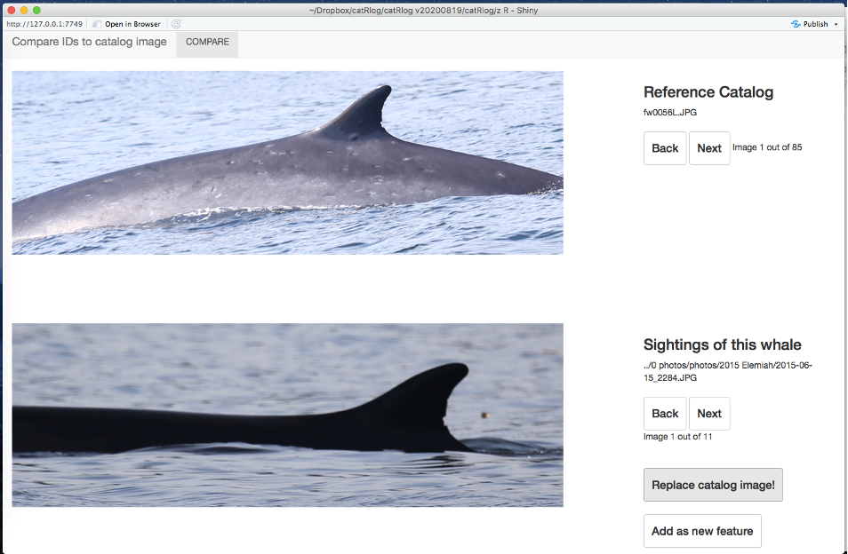{width=70%}
&nbsp;

The top image will show an individual in the reference catalog. The bottom images will be all instances of this individual found among the photo collections currently present 
within the catRlog system.

Note: the reference catalog will be filtered only to those individuals that have been seen in the photo collections.

Step through the sightings of this individual. If there is a better photo of the feature depicted in the reference catalog, click on “Replace catalog image!”. This will replace the current image in `catalog/catalog` (which will be sent to `catalog/replaced`, in case you make a mistake) with the new photo. 

If there is a photo with a feature not yet documented in the historical catalog, click "Add new feature". This will copy the new photo to `catalog/catalog` with the filename “<ID>X.<filetype>”. Example: “fw0043X.JPG”. Navigate to this folder in Finder and manually replace “X” with the correct feature code of your choice.  

Once you have done this for all individuals in the reference catalog, close the app.

Note that, if you ever have to manually correct the reference catalog in any way (e.g., finding an accidental duplicate within the catalog), keep notes on any changes within your own text file. 

&nbsp;  

##### Update event spreadsheets

Once all matches have an ID code, including new arrivals, you can update event tables to include these match results. Run this function to launch a `Shiny` app:  

```{r, echo=TRUE, eval=FALSE, include=TRUE, suppressWarnings=TRUE, suppressMessages=TRUE}
update_events()
```

&nbsp;  
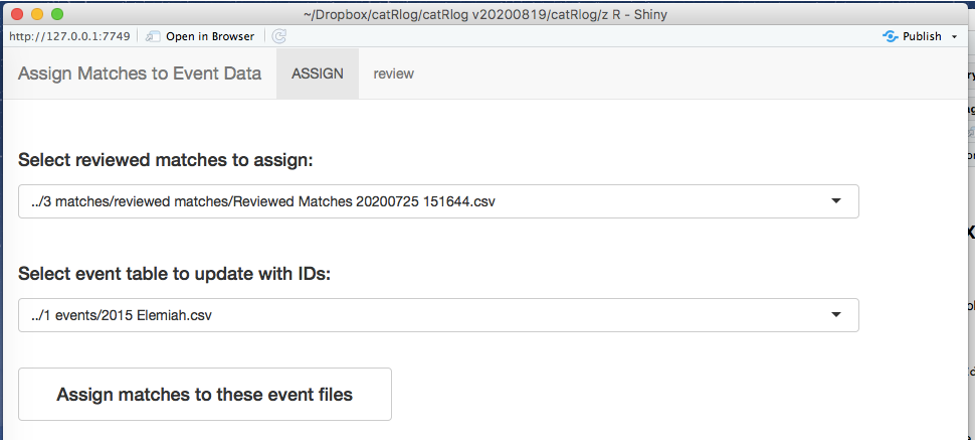{width=70%}
&nbsp;

- To assign match results to event spreadsheets, first select the Reviewed Matches you want to use. 
- Then select the event spreadsheet you want to update with the IDs in that match file.  
- Click “Assign matches to these event files”

This action will cause the following to occur:

- A backup version of the selected event file will be saved in `events/backups`.  

- In the original version of the event file, a column will be added and named `"id"`.  If a column named ‘id’ already exists, that column will be renamed ‘id.old’ so that it is not overwritten.  

- The match decision will be placed in this column according to the image filename listed in column ‘file’. Any match decision of “Photo too Poor” will appear as NA. Any event row whose image filename is not included in the match file will have ’NA’ placed in its ‘id’ column.  

- Close the app.

&nbsp;  

#### Prepare print-ready catalog


To ‘publish’ your historical catalog as a print-ready PDF, such as something like this...

&nbsp;  
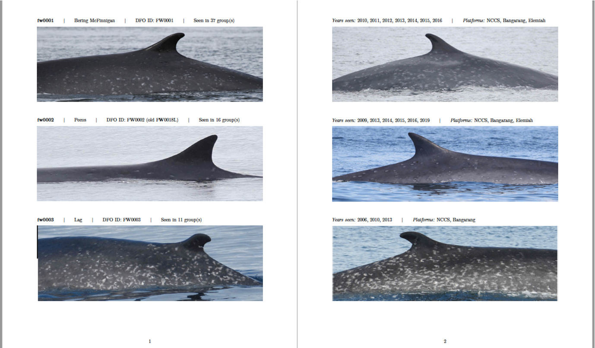{width=70%}
&nbsp;

...run the `print_catalog()` function. 

```{r, echo=TRUE, eval=FALSE, include=TRUE, suppressWarnings=TRUE, suppressMessages=TRUE}
print_catalog()
```

This function takes a single input, `settings`, which is a list that determines how exactly your catalog is compiled. 

*Under construction!*. 

These settings will determine how the PDF is created. The default settings are staged for a two-feature catalog in which the abbreviations are L (i.e., left dorsal)s and R (i.e., right dorsals). However, this can be changed by opting out of the default settings. 
The most important setting is “Features to Include”. You can specify one or two features and provide any feature code you wish – it just has to correspond to the feature code used in the image filenames within catRlog / 4 catalog / catalog.  See further details within the detail column of settings.txt.

**Tip:** if your catalog is large, I suggest building first with only a few IDs, e.g., 9, 
to make sure that PDF production works at the basic level. 

Compiling your PDF may take several minutes. You can track progress under the “R Markdown” console tab in R Studio. The PDF will be saved to `print/ID pages/`.  

Inside the `print` folder, there is also a folder staged for you to place front matter material (e.g., introduction, cover pages, acknowledgements, etc.). You can produce these in separate software, save them as a PDF, then use a PDF editor (e.g., [smallpdf.com](smallpdf.com) to merge the front matter together with the ID pages file of your choice.  

&nbsp;  


#### Compile datasets for analysis

When it is time to use your photo-identification database to address a research question, compile your data into the datasets you need using the following function...

```{r, echo=TRUE, eval=FALSE, include=TRUE, suppressWarnings=TRUE, suppressMessages=TRUE}
analysis_dashbaord()
```

... which launches this `Shiny` app:  

&nbsp;  
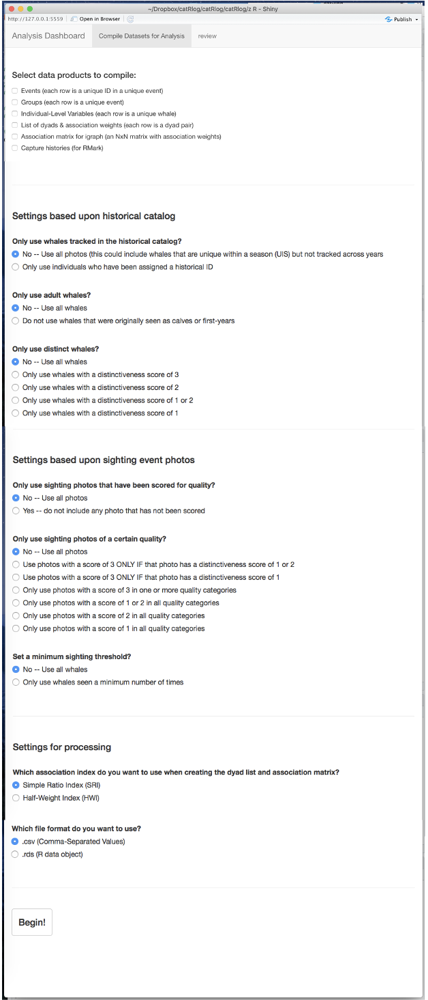{width=70%}
&nbsp;

- In this app, first select the datasets you wish to compile. (See examples of these data products in the next section.) Note that all of these datasets hinge upon the event spreadsheets in the `events` folder. If anything in those `events` spreadsheets are erroneous or incomplete, the datasets produced here will be also.   

- If you wish to control which events are included based on the quality of photographs, the distinctiveness of individuals, the reproductive status of individuals, or a minimum sighting threshold, specify those settings.   

- Note: Several of these settings require photo quality scores. The `score_photos()` function will summarize these scores as follows: the feature distinctiveness score will appear in a column named ‘distinct’. The image quality scores will be summarized into a single number (3 = one or more categories was a 3; 12 = all scores were either 1 or 2; 2 = all scores were 2; 1 = all scores were 1.). 

- Next, specify settings regarding the kind of association weights to calculate (if applicable), and the file type of the data output.   

- Click “Begin!” and track progress on the R Studio console.  

- Once the process is complete, you will be able to review the datasets under the ‘review’ tab, or within the `analysis/datasets` folder.  

Next we review the datasets produced by this app:  

###### **`"events.csv"`**

A compilation of all events spreadsheets (each row is a photo-identification event; i.e., there can be multiple rows for a single group encounter)

&nbsp;  
{width=70%}
&nbsp;

New columns: 
- `groupid` = unique identifier for each group (YYYYMMDDGG);   

- `doy` = the calendar day of year;   

- `yfrac` = the date as a fraction of year;    

- `path` = path to photo collection;   

- `distinct` and `score` (see notes above).  

- (`lat` and `lon` are included even if they did not exist in the original event tables. Missing values are assigned NA). 

###### **`"ILV.csv"`**

A summary of the encounter history for each individual (ILV = Individual-Level Variables; each row is a unique ID)

&nbsp;  
{width=70%}
&nbsp;

- Columns `id`, `local`, `mother`, and `calf` are copied from `catatlog key.csv`.   

- `n` = number of encounters  

- `ny` = number of years encountered.  

- `doy.min` and `doy.max` are the first and last days of year, respectively, that this individual has been encountered.  

- `years`, `doys`, and `groups` are blank-space-separated lists of the years, days of year, and groups in which this individual has been encountered. These lists make it efficient and easy to compile dyadic associations and other data.


###### **`"groups.csv"`**

A summary of each group encounter (each row is a unique encounter)

&nbsp;  
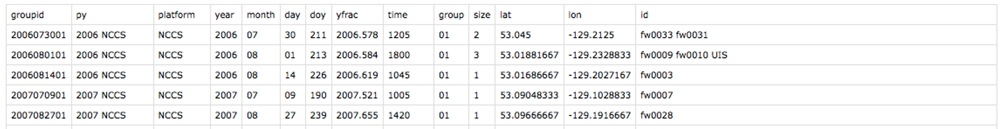{width=70%}
&nbsp;

New columns:   

- `groupid` = unique identifier for each group (YYYYMMDDGG) – unique to the entire event table.  

- `py` = Platform year descriptor.  

- `platform` = Platform.  

- `year`, `month`, `day`. 

- `doy` = the calendar day of year;   

- `yfrac` = the date as a fraction of year;    

- `time` 

- `group` = group identifier from day of field effort. 

- `size` = minimum group size (according to number of photo-identifications in encounter). 

- (`lat` and `lon` are included even if they did not exist in the original event tables. Missing values are assigned NA).  

- `id` = blank-space-separated list of the individuals identified within this group.  


###### **`"capture-histories.csv"`**

Capture history summary of each individual, formatted for use in Rmark.

&nbsp;  
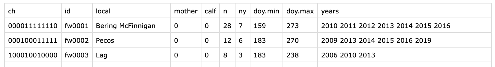{width=70%}
&nbsp;

New column: 

- `ch` = A digit for each sampling period (in the default case, years; this can be modified within the R code). 0= not observed; 1= observed.  


###### **`"dyads.csv"`**

Metrics for all possible dyadic associations. This spreadsheet can be extremely long if your catalog is large.

&nbsp;  
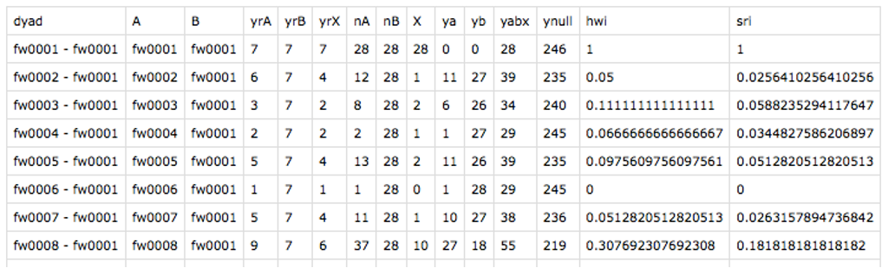{width=70%}
&nbsp;

- `yrA`, `yrB` = Number of years individuals A and B have been seen. 

- `yrX` = Number of years A and B have been encountered together in the same groups.  

- `nA`, `nB` = Number of encounters of A and B. 

- `X` = Number of encounters in which A and B have been found together. yA = Number of encounters with A in which B was absent.  

- `yB` = Number of encounters with B in which A was absent.  

- `yabx` = nA + nB – X. 

- `ynull` = Number of encounters that included neither A nor B.   

- `hwi` = Half-weight index of association.  

- `sri` = Simple-ratio index of association. 

###### **`"association-matrix.csv"`**

An N x N matrix in which the columns list out the individuals, the rows list out the same individuals in the same order, and the data in cells provide the association weights. In this example, the diagonal values (representing self-association weights) have not been corrected to 0.

&nbsp;  
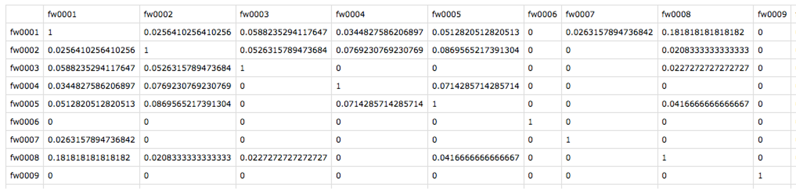{width=70%}
&nbsp;


## Troubleshooting & updating

If you discover any issues or ways to improve the package (we are sure there are many), please create a [Github Issue](https://github.com/ericmkeen/catRlog/issues).

&nbsp;  
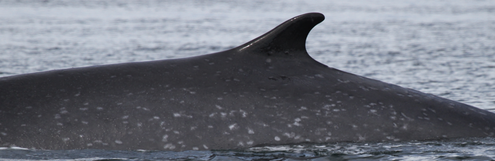{width=70%}
&nbsp;  

